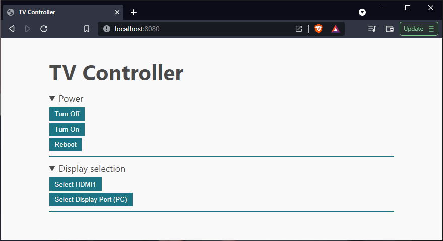
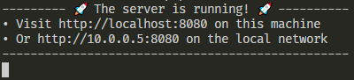

# TV Controller


## Description
Software contained in this repository sends serial commands over rs-232 port based on actions performed by user in a web interface.

## Usage
To download and run this program open the terminal on your linux machine and execute the following commands:
```bash
wget https://github.com/smolagakuba/tv-controller/releases/download/v0.0.1/tv-controller
chmod +x ./tv-controller
./tv-controller -port=/dev/ttyXX
```
Where `ttyXX` is the name of your serial port.  
If everything worked as expected then you should see a message like this one:  


## Compilation
To compile this software you should first install the Go programming language compiler (can be found at <https://go.dev>). Once the compiler is installed the build process reduces to just one command:
```bash
go build
```
Or if you want to compile for another platform you can for example run:
```
GOOS=linux GOARCH=386 go build
```
Which will compile the program for linux x86 platform.